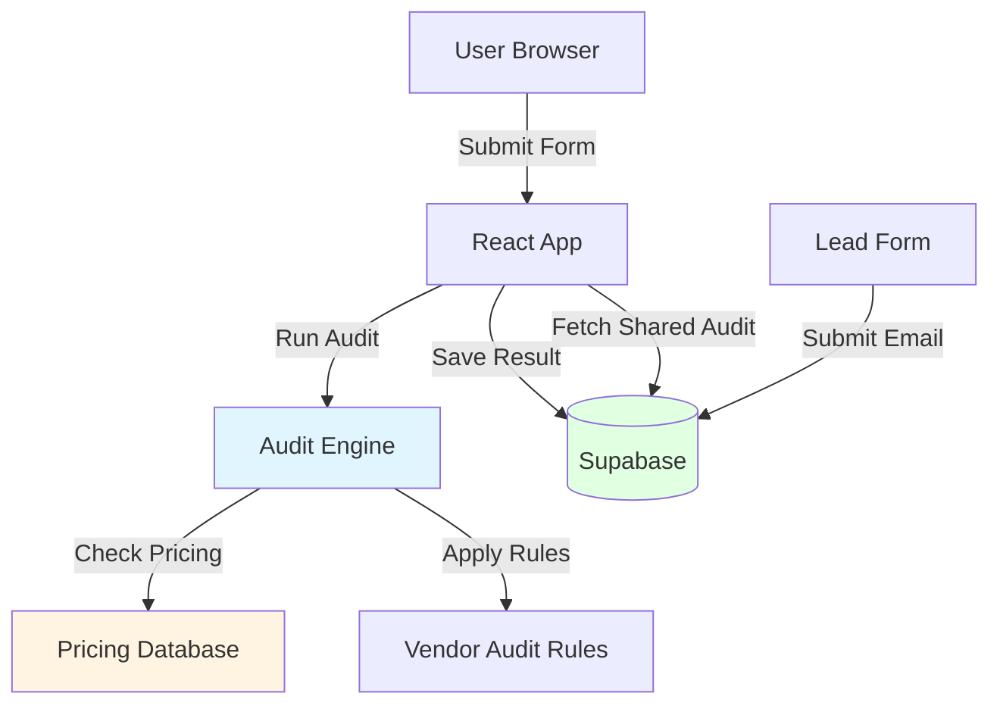

# ARCHITECTURE.md

## System Diagram



## Data Flow

**Audit Creation:**

1. User fills form (tools, plans, spending, use case)
2. Form state persists to localStorage
3. Client runs audit engine (pure functions, no API)
4. Result saved to Supabase
5. URL updates with `?audit=xxx` for sharing

**Shared Audit:**

1. User opens link with `?audit=xxx`
2. App fetches audit from Supabase
3. Public results displayed (no email/company data)

**Lead Capture:**

1. User enters email on results page
2. Lead saved to Supabase with audit_id reference
3. Email checked for duplicates

## Tech Stack

**Frontend:**

- React 18 + TypeScript
- Vite (build tool)
- Tailwind CSS (styling)

**Backend:**

- Supabase (PostgreSQL)
- Row Level Security enabled

**State:**

- localStorage for form persistence
- React useState for UI state
- No global state library needed

## Why This Stack?

- **React + TypeScript**: Type safety, component reusability
- **Vite**: Fast dev server, instant HMR
- **Supabase**: Free tier handles 50k rows, built-in auth for future, real-time if needed
- **No backend server**: Supabase handles DB + API, zero DevOps

## Key Design Decisions

**1. Client-Side Audit Engine**

- All calculations run in browser (no API calls)
- Instant results, no server cost
- Deterministic logic = easier debugging

**2. Pricing Data as JSON**

- Hardcoded in `pricing-data.ts`
- Updated manually when vendors change prices
- Cited with URLs + verification dates

**3. No Authentication Required**

- Audits are public by default
- Email captured after value shown
- Lowers friction for sharing

**4. LocalStorage for Form State**

- Survives page refreshes
- Better UX than losing data
- Simple implementation

**5. Supabase RLS Policies**

- Public read for `is_public=true` audits
- Anyone can insert (rate limiting via client IP)
- Leads tied to audits via foreign key

## Database Schema

```sql
audit_results
  - id (text, PK)
  - tools (jsonb)
  - recommendations (jsonb)
  - total_monthly_savings (decimal)
  - total_annual_savings (decimal)
  - use_case (text)
  - team_size (int)
  - ai_summary (text, nullable)
  - created_at (timestamp)
  - is_public (boolean)

leads
  - id (uuid, PK)
  - audit_id (text, FK)
  - email (text)
  - company_name (text, nullable)
  - role (text, nullable)
  - team_size (int, nullable)
  - created_at (timestamp)
```

## Scaling to 10k Audits/Day

**Current bottlenecks:**

- Supabase free tier: 500MB storage
- No caching
- Client-side compute (fine for now)

**Changes needed:**

1. **Caching**: Add Redis for common audit results (hash tool configs)
2. **Database**: Upgrade Supabase to Pro ($25/mo) or partition old audits to archive
3. **Rate Limiting**: Move from client-side to edge middleware (Cloudflare Workers)
4. **Analytics**: Add Plausible/PostHog to track conversion funnel

**Cost at 10k/day:**

- Supabase Pro: $25/mo (2GB DB, 250k requests/day)
- Total: ~$300/year

---

**Last Updated**: 2026-05-09  
**Stack**: React 18, TypeScript, Vite, Supabase, Tailwind
