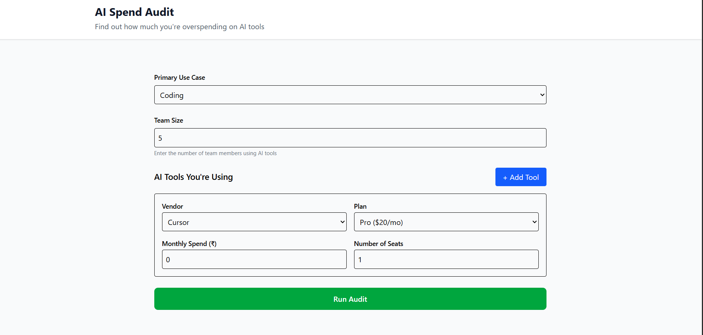
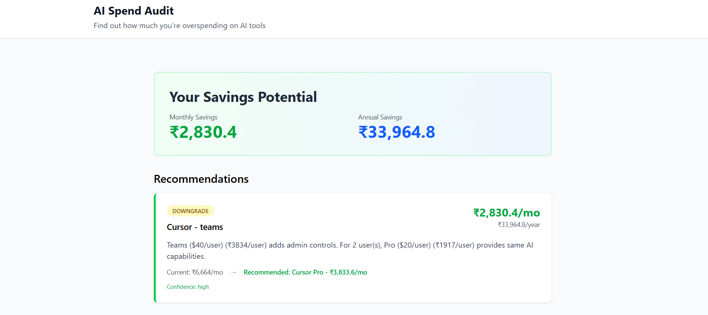
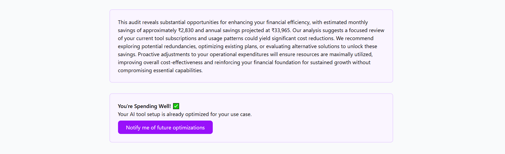
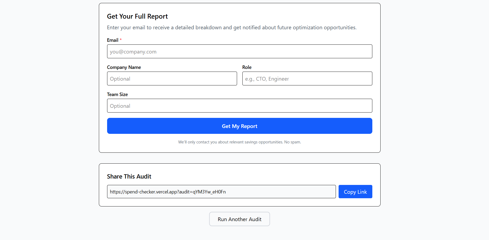

# AI Spend Audit

AI Spend Audit is a web application that helps users specifically managers, ai tool tech users, CTOs, analyze how much they are spending on AI tools monthly and annually. Based on the selected tools and usage patterns, the platform evaluates whether the current subscriptions are cost-effective or if there are better alternatives that provide similar functionality at a lower price.

The goal of the project is to help individuals and teams identify unnecessary AI spending, optimize subscriptions, and make informed decisions without affecting productivity.

---

## Features

- Calculate monthly and annual AI tool spending
- Detect potential overspending
- Recommend cost-effective alternatives
- Generate AI-powered audit summaries
- Shareable audit result URLs
- Persistent audit data during page reloads
- Responsive and optimized frontend experience

---

## Screenshots / Demo

Example:

```md




```

---

## Quick Start

### 1. Clone the Repository

```bash
git clone https://github.com/bawanetejas/Spend_Checker.git
cd Spend_Checker
```

---

### 2. Install Dependencies

```bash
npm install
```

---

### 3. Configure Environment Variables

Create a `.env` file and add the following credentials:

```env
VITE_USD_TO_INR=95.84
USD_TO_INR=95.84

RESEND_API_KEY=*****

VITE_SUPABASE_URL=*****
VITE_SUPABASE_ANON_KEY=*****

GEMINI_API_KEY=*****
```

---

### 4. Run Locally

Run the frontend and serverless functions locally using:

```bash
vercel dev
```

---

## Deployment

The project is deployed on Vercel:

[AI Spend Audit Live Demo](https://spend-checker.vercel.app/?utm_source=chatgpt.com)

---

# Decisions & Trade-offs

## 1. Used Honeypot Instead of hCaptcha

I chose Honeypot protection instead of hCaptcha because it is lightweight, developer-friendly, easy to implement, and scalable without introducing additional dependencies.

hCaptcha adds friction to the user experience and becomes a paid service at scale. It also requires more implementation time compared to Honeypot protection.

---

## 2. Chose React for Frontend Development

I selected React because I already had experience with it and needed to launch the product quickly while maintaining a smooth user experience.

Using an unfamiliar tech stack would have increased development time and reduced delivery speed. The primary focus was building a functional product that solves a real problem rather than experimenting with technologies.

---

## 3. Used Resend for Email Services

Resend was selected because it is simple to integrate and requires less setup time compared to other email providers.

It allowed rapid implementation of email functionality during development. Currently, the free-tier limitations only allow email delivery to verified accounts.

---

## 4. Redesigned the Audit Logic Midway

Initially, the audit recommendation logic was heavily AI-generated. However, the recommendations were not accurate enough for real-world use cases.

To improve reliability, I manually redesigned the audit logic to better detect relevant use cases, subscription patterns, and potential savings opportunities.

---

## 5. Used Gemini API for AI Features

I chose the Gemini API because it provides a generous free-tier limit and is straightforward to integrate.

Other alternatives, such as Claude, did not provide a suitable free-tier option during development, making Gemini a more practical choice for meeting the project requirements.

---

## Tech Stack

- React
- TypeScript
- Vite
- Supabase
- Vercel Serverless Functions
- Gemini API
- Resend
- Tailwind CSS

---

## Goal of the Project

The project is designed to help users answer a simple but important question:

> “Am I overpaying for AI tools?”

By providing clear spending insights and realistic recommendations, AI Spend Audit helps users make smarter and more cost-effective AI subscription decisions.
